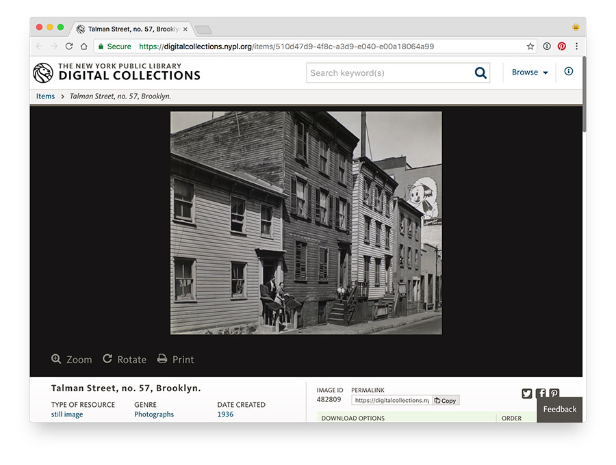

# Tutorial: Tracing Historical Streets with QGIS

New York's streets have changed a lot over time: new street grids were projected over old farm roads, housing projects were constructed, often spanning multiple city blocks, and the construction of highways, too, drastically changed the street layout of the city's neighborhoods.

Some examples:

- [1857 map of the Lower East Side, overlayed over OpenStreetMap](http://maps.nypl.org/warper/maps/7135#Preview_tab)
- [Talman Street in Brooklyn](http://maps.nypl.org/warper/maps/19260#Preview_tab), gone after the construction of the Brooklyn-Queens Expressway (there is [no more Talman Street](https://www.openstreetmap.org/search?query=talman%20street%2C%20brooklyn#map=17/41.52250/-72.07183) in New York City)

Yet, it's very important having data about the changing names and location of New York City's streets; we need this data to to georeference [city directories](https://digitalcollections.nypl.org/items/3ec3e000-5298-0134-997b-00505686a51c#/?uuid=4223d090-5298-0134-198a-00505686a51c), to make maps of [historical photos](https://www.oldnyc.org/), and to allow patrons to geographically browse the Library's [Digital Collections](https://digitalcollections.nypl.org/).

__We need your help! See below how you can help us tracing streets from historic maps, using QGIS.__

## Getting Ready

First, download [QGIS](http://www.qgis.org/en/site/forusers/download.html), and install the application by following their instructions. If all goes well, start QGIS, it should look a little like this:

