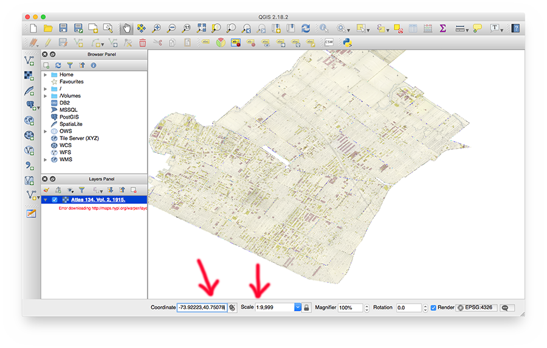
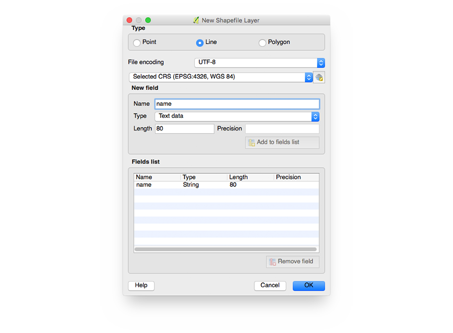
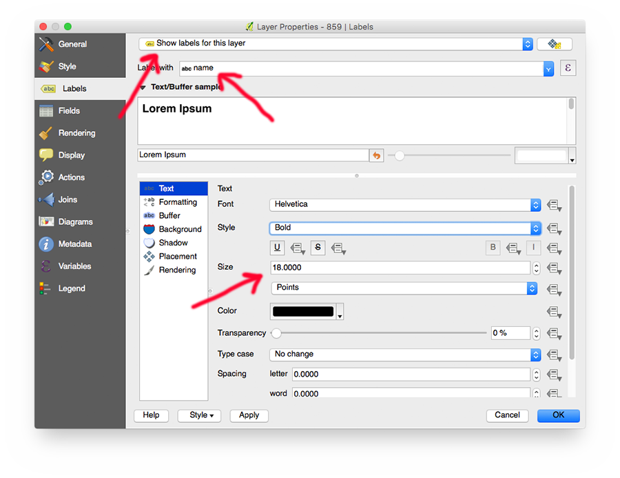

# Tutorial: Tracing Historical Streets with QGIS

New York's streets have changed a lot over time: new street grids were projected over old farm roads, housing projects were constructed, often spanning multiple city blocks, and the construction of highways, too, drastically changed the street layout of the city's neighborhoods.

Some examples:

- [1857 map of the Lower East Side](http://maps.nypl.org/warper/maps/7135#Preview_tab)
- [Talman Street in Brooklyn](http://maps.nypl.org/warper/maps/19260#Preview_tab), gone after the construction of the Brooklyn-Queens Expressway (today, there is [no more Talman Street](https://www.openstreetmap.org/search?query=talman%20street%2C%20brooklyn#map=17/41.52250/-72.07183) to be found in New York City)

Yet, it's very important having data about the changing names and shapes of New York City's streets; we need this data to to georeference [city directories](https://digitalcollections.nypl.org/items/3ec3e000-5298-0134-997b-00505686a51c#/?uuid=4223d090-5298-0134-198a-00505686a51c), to make maps of [historical photos](https://www.oldnyc.org/), and to allow patrons to geographically browse the Library's [Digital Collections](https://digitalcollections.nypl.org/).

## Contributing

Historical street data are an important part of NYPL's [NYC Space/Time Directory project](http://spacetime.nypl.org/). By combining [data](http://buildinginspector.nypl.org/data) from [Building Inspector](http://buildinginspector.nypl.org/), NYPL's website for crowdsourced extraction of historical building footprints and addresses, with the locations and names of historical streets, it is possible to create search tools and visualizations for historical addresses. To see how this is done in detail, see https://github.com/bertspaan/tutorial-historical-addresses.

The latest historical street data can be found here: https://github.com/nypl-spacetime/nyc-historical-streets. We have started tracing some of the maps ourselves, but there are many maps and atlases with which we need your help!

How to contribute:

- See https://github.com/nypl-spacetime/nyc-historical-streets for up-to-date list of maps and atlases
- Fork the repository!
- Use QGIS to make changes to a Shapefile
- Submit a [pull request](https://help.github.com/articles/about-pull-requests/)

__To keep track of who is doing what, please send an email to bertspaan@nypl.org before you start (or open an issue in the original GitHub repository.__

For more information about contributing to the NYC Space/Time Directory, see http://spacetime.nypl.org/#contributing.

## Getting Ready

First, download [QGIS](http://www.qgis.org/en/site/forusers/download.html), and install the application by following their instructions. If all goes well, start QGIS, it should look a little like this:

### Keyboard shortcuts

By default, QGIS does not have very convenient keyboard shortcuts for creating and editing polygonal lines. This repository contains a QGIS shortcut definitions file: [`qgis-shortcuts.xml`](qgis-shortcuts.xml). Download this file, choose _Settings ⟶ Configure Shortcuts..._, click _Load..._ and select the shortcut XML file.

Keyboard shortcuts:

- `E`: toggle editing mode on/off for the selected layer (prompts for save when toggling off)
- `L`: draw a line (line type layer, editing mode on, right-click to stop drawing)
- `N`: move a line node (connected nodes will move together)
- `M`: move an entire line (connected nodes **do not** move together)
- `I`: identify a line (opens a window with a form to edit line data)
- `S`: select a line
- `D`: delete selected line (identify does not select)
- `Z`: zoom tool
- `Delete` (`Fn+Delete` on Mac) deletes selected points
- `Spacebar`: pan map tool
- To finish editing a line, right click anywhere in the map

## Improving existing data

### Setting up

- Pick a map or atlas from https://github.com/nypl-spacetime/nyc-historical-streets
- Fork and clone this GitHub repository:

    git clone https://github.com/<your-github-name>/nyc-historical-streets

- Open the map or atlas's QGIS project (e.g. `1162/trace-1162.qgs`)
- Zoom to the extent of the street data by right-clicking on the layer in the _Layers Panel_, and clicking _Zoom to Layer_:

### Tracing

- Make sure snapping is enabled: _Settings ⟶ Snapping Options..._

- Start editing the street layer: _Layer ⟶ Toggle Editing_ (or press `E`)
- Add a new street: _Edit ⟶ Add Feature_ (or press `L`)
- Add a vertex on each cross street (we need those vertices to later snap vertices from other streets to)

- Finish the street by right clicking on the map, you will be asked to enter the street's name (you can later easily edit the street and add or remove vertices)
- Enter the street name using the correct letter case, without abbreviations:
  - _ISSABELLA PL. ⟶ Isabella Place_
  - _MACDOUGAL STREET ⟶ MacDougal Street_
  - _WOOLSEY ⟶ Woolsey Street_

- To save the edited Shapefile, click _Toggle Editing_ again (or press `E`), and save the changed to the Shapefile

## Starting a new project

This section describes creating a new street trace project in QGIS.

### Setting up

- Create a new QGIS project
- Add the historical map as base layer:
  - Select _Layer ⟶ Add Layer ⟶ Add WMS/WMTS Layer..._
  - Copy the _WMS Capabilties URL_ from Map Warper's [Export tab](http://maps.nypl.org/warper/layers/1162#Export_tab)
  - In the _Add Layer_ dialog, click _New_, choose a name and paste the WMS URL

  - Click _Connect_, select the correct layer, and set the tile size to 255x256 PNG.
  - Click _Add_, and then _Close_

  - To view the layer you just added, do the following:
    - Set scale to _1:10,000_
    - Find a coordinate that should be somewhere on the map, for example using [bertspaan.nl/latlong](http://bertspaan.nl/latlong/#14/40.7619/-73.9249)
    - Enter this coordinate: _-73.93001, 40.75101_ (first longitude, then latitude)

- Now, add create a new Shapefile Layer:
  - Select _Layer ⟶ Create Layer ⟶ New Shapefile Layer..._
  - Type should be _Line_
  - Remove the `id` column, and add a field of type _Text data_ with the name `name`. This field will contain the street name.

  - Afterwards, QGIS will ask to save the Shapefile on disk.
  - Pick a place, choose a name - for example `<layerId>/<layerId>.shp` (in this case, `1162/1162.shp`)

- Set snapping options: _Settings ⟶ Snapping Options..._

- Right click the new Shapefile layer to go to the _Layer Properties_ window
- Set the line width and color of the layer

- Enable labels, and choose the `name` field

- Change label placement

- Add a buffer around the labels for better visibility

### Tracing

See the [_Tracing_ paragraph](https://github.com/nypl-spacetime/qgis-trace-tutorial#tracing) in the _Improving existing data_ section.
